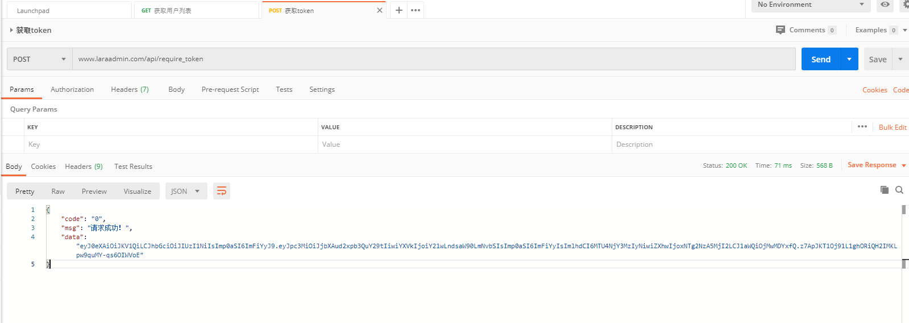

# laravel+react实战打造企业级高并发分布式电商小程序（一）

整体使用laravel7+react打造整个电商小程序。里面会涉及到高并发的知识，mysql的分库分表，主从读写分离的配置，redis集群的使用，缓存系统的使用，队列系统的使用等。

先初始化一个laravel的项目。然后配置好`.env`文件。


## 基础建设

我们使用前后端分离就要考虑跨域问题和安全问题。跨域使用`cors`解决，laravel7里面内置了`cors`的解决方案，我们只要修改`config/cors.php`配置文件就好了。

把里面的值更改一下。修改这个值的原因是因为我们会使用jwt传一个token的请求头过来进行验证。这个时候还是报跨域的错误，所以将`supports_credentials`值修改为true，如果不报错就不需要修改了。

```php

'supports_credentials' => true,

```

把这个参数的值修改为true。

安全问题使用`jwt`的解决方案，安装`jwt`的包。

> composer require lcobucci/jwt

在routes/api.php路由文件中增加下面的路由

```php

//获取jwt token
Route::post('/require_token', 'JWT\RequireTokenController@requireToken');

```

在config下面新建`jwt.php`文件，里面内容如下

```php

<?php

return [
    'JWT_SECRET' => env('JWT_SECRET','DvYUz+woS7vVJe6ldY+PqWoUbhIyY9rShzM0NAfzxdU='),
    'JWT_EXP_TIME' => env('JWT_EXP_TIME','36000'),
];

```

在`.env`中增加下面的内容

```php

# jwt
JWT_SECRET=DvYUz+woS7vVJe6ldY+PqWoUbhIyY9rShzM0NAfzxdU=   
JWT_EXP_TIME=36000  //过期时间

```

在`app/http/middleware`中创建中间件`jwtCheck.php`,内容如下

```php

<?php

namespace App\Http\Middleware;

use App\Models\Sys\ErrorModel;
use Closure;
use \Lcobucci\JWT\Parser;
use \Lcobucci\JWT\Signer\Hmac\Sha256;

class jwtCheck
{
    /**
     * Handle an incoming request.
     *
     * @param  \Illuminate\Http\Request  $request
     * @param  \Closure  $next
     * @return mixed
     */
    public function handle($request, Closure $next)
    {

        $parser = new Parser;
        $signer = new Sha256;
        $secret = config('jwt.JWT_SECRET');

        if($request->hasHeader('Authorization')){
            $token = $request->header('Authorization');
            //解析token
            $parse = $parser->parse($token);
            //验证token合法性
            if (!$parse->verify($signer, $secret)) {
                return response()->json(['code'=>ErrorModel::JWT_ERROR, 'msg'=>'令牌错误！']);
            }

            //验证是否已经过期
            if ($parse->isExpired()) {
                return response()->json(['code'=>ErrorModel::JWT_ERROR, 'msg'=>'令牌过期！']);
            }
        }else{
            return response()->json(['code'=>ErrorModel::JWT_ERROR, 'msg'=>'令牌缺失！']);
        }
        //把token放到参数里面
        request()->offsetSet('token', $token);
        return $next($request);
    }
}

```

在`app/http`下面的`Kernel.php`文件里面的`$routeMiddleware`变量里面增加下面内容，把中间件注册到系统中。

```php
'jwtCheck' => \App\Http\Middleware\jwtCheck::class,

```

#### 控制器

创建控制器

在`app/http/controller`下面创建`jwt`文件夹，然后在`jwt`文件夹里面创建`RequireTokenController.php`文件。

```php

<?php

namespace App\Http\Controllers\JWT;

use App\Http\Controllers\Controller;
use Illuminate\Http\Request;
use \Lcobucci\JWT\Builder;
use \Lcobucci\JWT\Signer\Hmac\Sha256;
use Illuminate\Support\Facades\Redis;

class RequireTokenController extends Controller
{
    public function requireToken(Builder $builder, Sha256 $signer) {

        $secret = config('jwt.JWT_SECRET');
        $time = time();
        $expTime = config('jwt.JWT_EXP_TIME');

        do {
            //设置header和payload，以下的字段都可以自定义
            $builder->setIssuer("cmp.wliot.com") //发布者
                    ->setAudience("cmp.wliot.com") //接收者
                    ->setId("abc", true) //对当前token设置的标识
                    ->setIssuedAt($time) //token创建时间
                    ->setExpiration($time + $expTime) //过期时间
                    // ->setNotBefore($time + 5) //当前时间在这个时间前，token不能使用
                    ->set('uid', 30061); //自定义数据

            //设置签名
            $builder->sign($signer, $secret);
            //获取加密后的token，转为字符串
            $token = (string)$builder->getToken();
        } while (Redis::exists($token));
        //存入redis
        // Redis::setex($token, $expTime, json_encode([]));

        return $this->success($token);
    }
}
```

在这里面使用到了`$this->success()`方法，这个方法来自controller类，我们需要编写这个方法。

在`app/http`下面创建`Utils`文件夹，在里面创建`Success.php`文件。

```php

<?php

namespace App\Http\Utils;

use App\Models\Sys\ErrorModel;

trait Success {

    function success($data = []) {
        $res = ['code'=>'0','msg'=>'请求成功！', 'data'=>$data];
        return response()->json($res);
    }
}

```

修改`app/http/controllers/controller.php`文件

```php

use App\Http\Utils\Success;  //引入刚才的文件

class Controller extends BaseController {
    use AuthorizesRequests, DispatchesJobs, ValidatesRequests, Success;  //在这里添加Success 也就是刚才的文件。
}

```


在这里面使用到了redis，所以我们需要启动你本地的redis服务器。启动之后就可以访问我们上面填写的路由了，使用postman访问你的路由。



可以看到返回了正确的token。

在后面的访问请求中我们需要使用这个token。我们把它加入请求头。在请求头新建一个`Authorization`的key，他的值就是我们的token。


