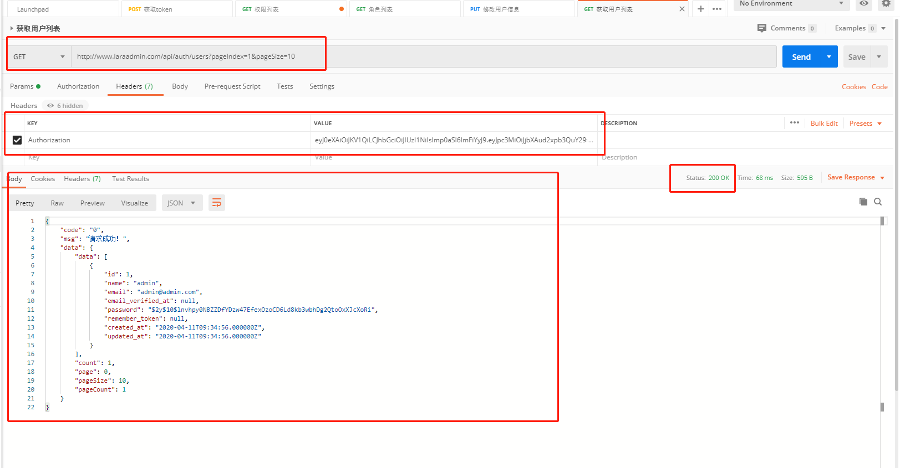
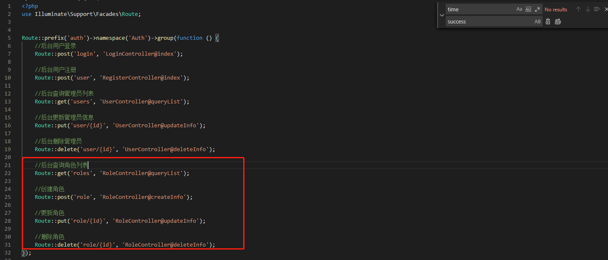
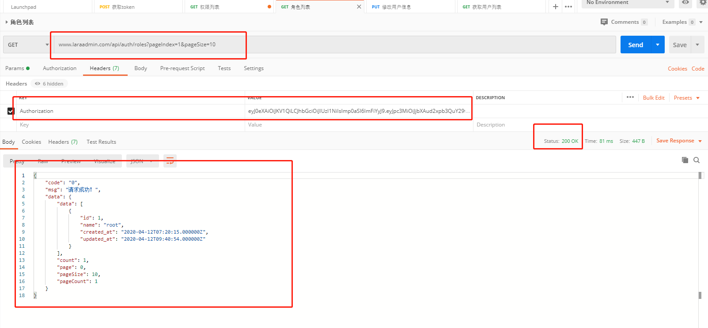
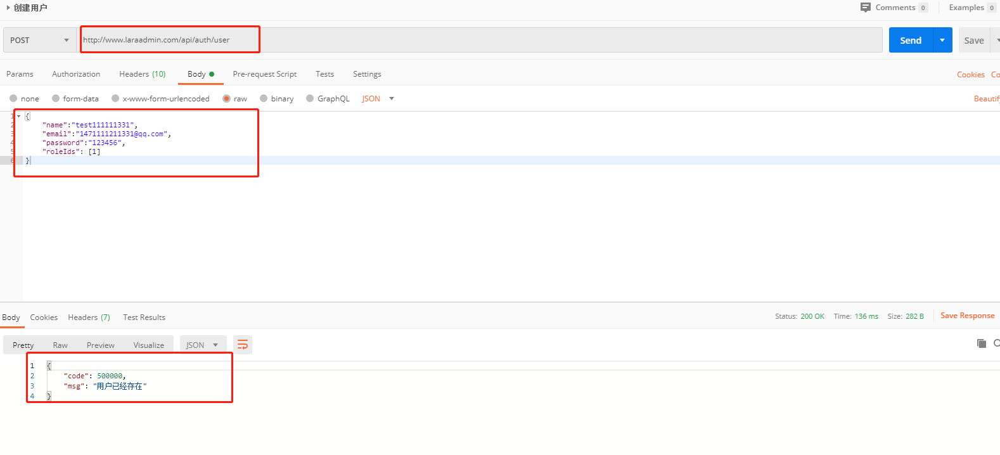
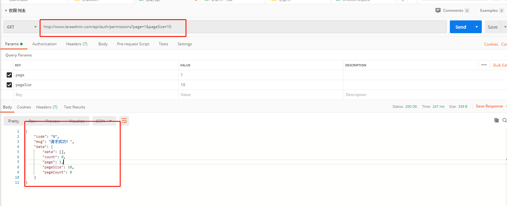

# laravel+react实战打造企业级高并发分布式电商小程序（一）

整体使用laravel7+react打造整个电商小程序。里面会涉及到高并发的知识，mysql的分库分表，主从读写分离的配置，redis集群的使用，缓存系统的使用，队列系统的使用等。

先初始化一个laravel的项目。然后配置好`.env`文件。

## 权限管理

既然是电商肯定有后台，要做权限管理这块。

先创建表，这里使用`laravel`的`migration`。下面是后台用户表。

```php
<?php

use Illuminate\Database\Migrations\Migration;
use Illuminate\Database\Schema\Blueprint;
use Illuminate\Support\Facades\Schema;

class CreateUsersTable extends Migration
{
    /**
     * Run the migrations.
     *
     * @return void
     */
    public function up()
    {
        Schema::create('auth_users', function (Blueprint $table) {
            $table->bigIncrements('id');
            $table->string('name', 100)->unique();
            $table->string('email', 100)->unique();
            $table->timestamp('email_verified_at')->nullable();
            $table->string('password');
            $table->rememberToken();
            $table->timestamps();
        });
    }

    /**
     * Reverse the migrations.
     *
     * @return void
     */
    public function down()
    {
        Schema::dropIfExists('auth_users');
    }
}

```

下面是角色表

```php

<?php

use Illuminate\Database\Migrations\Migration;
use Illuminate\Database\Schema\Blueprint;
use Illuminate\Support\Facades\Schema;

class CreateRolesTable extends Migration
{
    /**
     * Run the migrations.
     *
     * @return void
     */
    public function up()
    {
        Schema::create('auth_roles', function (Blueprint $table) {
            $table->bigIncrements('id');
            $table->string('name', 100)->unique();
            $table->timestamps();
        });
    }

    /**
     * Reverse the migrations.
     *
     * @return void
     */
    public function down()
    {
        Schema::dropIfExists('auth_roles');
    }
}


```

下面是权限表

```php
<?php

use Illuminate\Database\Migrations\Migration;
use Illuminate\Database\Schema\Blueprint;
use Illuminate\Support\Facades\Schema;

class CreatePermissionsTable extends Migration
{
    /**
     * Run the migrations.
     *
     * @return void
     */
    public function up()
    {
        Schema::create('auth_permissions', function (Blueprint $table) {
            $table->bigIncrements('id');
            $table->string('name',100)->unique();
            $table->timestamps();
        });
    }

    /**
     * Reverse the migrations.
     *
     * @return void
     */
    public function down()
    {
        Schema::dropIfExists('auth_permissions');
    }
}

```

下面是用户角色关联表

```php

<?php

use Illuminate\Database\Migrations\Migration;
use Illuminate\Database\Schema\Blueprint;
use Illuminate\Support\Facades\Schema;

class CreateUserRolesTable extends Migration
{
    /**
     * Run the migrations.
     *
     * @return void
     */
    public function up()
    {
        Schema::create('auth_user_roles', function (Blueprint $table) {
            $table->bigIncrements('id');
            $table->bigInteger('user_id');
            $table->bigInteger('role_id');
            $table->timestamps();
        });
    }

    /**
     * Reverse the migrations.
     *
     * @return void
     */
    public function down()
    {
        Schema::dropIfExists('auth_user_roles');
    }
}


```

下面是角色和权限关联表

```php

<?php

use Illuminate\Database\Migrations\Migration;
use Illuminate\Database\Schema\Blueprint;
use Illuminate\Support\Facades\Schema;

class CreateRolePerimissionsTable extends Migration
{
    /**
     * Run the migrations.
     *
     * @return void
     */
    public function up()
    {
        Schema::create('auth_role_permissions', function (Blueprint $table) {
            $table->bigIncrements('id');
            $table->bigInteger('user_id')->default(0);
            $table->bigInteger('role_id');
            $table->bigInteger('perimission_id');
            $table->timestamps();
        });
    }

    /**
     * Reverse the migrations.
     *
     * @return void
     */
    public function down()
    {
        Schema::dropIfExists('auth_role_permissions');
    }
}

```

下面这张是系统错误信息表，这里会返回错误信息，这些错误信息全部存放在这张表里。

```php

<?php

use Illuminate\Database\Migrations\Migration;
use Illuminate\Database\Schema\Blueprint;
use Illuminate\Support\Facades\Schema;

class CreateSysErrorsTable extends Migration
{
    /**
     * Run the migrations.
     *
     * @return void
     */
    public function up()
    {
        Schema::create('sys_errors', function (Blueprint $table) {
            $table->bigIncrements('id');
            $table->string('code',100)->unique()->comment('错误编码');
            $table->string('msg')->comment('错误信息');
            $table->timestamps();
        });
    }

    /**
     * Reverse the migrations.
     *
     * @return void
     */
    public function down()
    {
        Schema::dropIfExists('sys_errors');
    }
}

```

创建完这些执行迁移命令就可以了。

> php artisan migrate

当然了，在这之前确保你的`.env`文件已经配置好了数据库连接。


我们有了后台数据还需要一个管理员账户，使用`seed`填充。

```php

<?php

use App\Models\Auth\UserModel;
use Illuminate\Database\Seeder;
use Illuminate\Support\Facades\Hash;

class UsersTableSeeder extends Seeder
{
    /**
     * Run the database seeds.
     *
     * @return void
     */
    public function run(UserModel $user)
    {
        $user->name = 'admin';
        $user->email = 'admin@admin.com';
        $user->password = Hash::make('123456');
        $user->save();

    }
}

```

运行填充命令

> php artisan db:seed

### 控制器

这里我们使用一个`laravel`的扩展包，使用composer安装他

> composer require thepatter/query-common

安装完后查看我的这个文章来使用这个包，根据文章里面做完之后再回来看下面的内容。

> https://blog.csdn.net/Thepatterraining/article/details/105408363

接下来使用`artisan`命令创建我们的控制器。

> php artisan make:queryController Auth/UserController

创建完之后在创建model

> php artisan make:model Models/Auth/UserModel

修改刚才的`Auth/UserModel`，在里面增加`table`属性。

```php

<?php

namespace App\Models\Auth;

use Illuminate\Database\Eloquent\Model;

class UserModel extends Model
{
    //
    protected $table = 'auth_users';
}

```

修改刚才的`Auth/UserController`控制器。

```php

<?php

namespace App\Http\Controllers\Auth;

use QueryCommon\QueryController;
use App\Models\Auth\UserModel;
use App\Models\Auth\UserRoleModel;

class UserController extends QueryController
{
    /**
     * 字典数组
     * ['表里的字段名' => '字典code',...]
     */
    protected $dicArr = [];

    /**
     * 字段映射 可选，不填默认转成下划线格式
     * ['搜索字段' => '表字段',...]
     */
    protected $filedsAdapter = [];

    /**
     * 创建时候的字段映射 可选，不填默认转成下划线格式
     * ['输入字段' => '表字段']
     */
    protected $createAdapter = [
        'name' => 'name',
        'email' => 'email',
    ];

    //定义表名 格式: table as t
    protected $shortTableName;


    protected function getModel() {
        $this->model = new UserModel;
        return $this->model;
    }

}


```

这时候我们对用户的增删改查操作就完成了，是不是超级简单呢。这主要依赖于我们的`query-common`扩展包。


我们接下来只需要添加对应的路由就可以了。在`routes`下面创建`Api/Auth`文件夹。在里面创建`index.php`路由文件。

```php

<?php
use Illuminate\Support\Facades\Route;


Route::prefix('auth')->namespace('Auth')->group(function () {
    //后台创建用户
    Route::post('user', 'UserController@createInfo');

    //后台查询管理员列表
    Route::get('users', 'UserController@queryList');

    //后台更新管理员信息
    Route::put('user/{id}', 'UserController@updateInfo');

    //后台删除管理员
    Route::delete('user/{id}', 'UserController@deleteInfo');

});

```

添加完路由文件后我们需要自动加载路由文件，请看我的这篇文章，路由自动加载。

> https://blog.csdn.net/Thepatterraining/article/details/105386868

接下来可以使用`postman`来测试了。

获取用户列表



其他的就不放图了。

## 角色

有了用户就有角色了，我们的角色表在之前已经创建好了，我们现在同样的方法创建controller和model。

执行下面的命令。`-m`参数是model，这里指定model后，如果model不存在会自动创建。

> php artisan make:queryController Auth/RoleController -m Models/Auth/RoleModel

修改刚才的`Auth/RoleModel`，在里面增加`table`属性。

```php

<?php

namespace App\Models\Auth;

use Illuminate\Database\Eloquent\Model;

class RoleModel extends Model
{
    //
    protected $table = 'auth_roles';
}

```

`app/Http/Controllers/Auth/RoleController`文件内容如下

```php

<?php

namespace App\Http\Controllers\Auth;

use QueryCommon\QueryController;
use App\Models\Auth\RoleModel;

class RoleController extends QueryController
{
    /**
     * 字典数组
     * ['表里的字段名' => '字典code',...]
     */
    protected $dicArr = [];

    /**
     * 字段映射 可选，不填默认转成下划线格式
     * ['搜索字段' => '表字段',...]
     */
    protected $filedsAdapter = [];

    /**
     * 创建时候的字段映射 可选，不填默认转成下划线格式
     * ['输入字段' => '表字段']
     */
    protected $createAdapter = [];

    //定义表名 格式: table as t
    protected $shortTableName;


    protected function getModel() {
        $this->model = new RoleModel();
        return $this->model;
    }

}
```

接着在刚才的`routes/Api/Auth/index`路由文件中增加下面的内容

```php

//后台查询角色列表
    Route::get('roles', 'RoleController@queryList');

    //创建角色
    Route::post('role', 'RoleController@createInfo');

    //更新角色
    Route::put('role/{id}', 'RoleController@updateInfo');

    //删除角色
    Route::delete('role/{id}', 'RoleController@deleteInfo');

```

增加后是下图这样



同样使用postman测试。



#### 用户和角色关联

有了用户和角色就要把这两个关联起来了，我们通过在创建用户和修改用户的时候关联角色，在这时候就要更改之前的`Auth/UserController`了。

增加下面的函数。

```php

    /**
     * 创建完用户后执行的操作
     */
    protected function createAfter($id) {
        $this->userRole($id);
    }

    //更新完主表之后可以进行的操作
    protected function updateAfter($id) {
        //更新完用户信息需要更新用户角色关联
        //先删除所有关联，再重新创建
        UserRoleModel::where('user_id', $id)->delete();

        $this->userRole($id);

    }


    /**
     * 用户角色操作，先删除用户的所有角色，再创建角色关联
     * @param int $id 用户id
     */
    private function userRole($id) {
        $ids = $this->request->input('roleIds');
        //组织数据
        $insertDatas = [];
        foreach ($ids as $roleId) {
            $insertData = [];
            $insertData['user_id'] = $id;
            $insertData['role_id'] = $roleId;
            $insertData['created_at'] = date('Y-m-d H:i:s');
            $insertDatas[] = $insertData;
        }
        //一次性插入
        UserRoleModel::insert($insertDatas);
    }
```

`createAfter`方法是在创建完用户后执行的，`updateAfter`方法是更新完用户信息后执行的。传入用户id。我们在这里删除之前的用户和角色关联，把新的循环添加到数组中，一次性插入数据库。因为循环插入会进行多次`数据库io`操作，而数据库io是比较耗费资源和时间的，所以我们尽可能少进行数据库操作。

在创建和更新时候我们还需要验证参数，我们再添加下面的方法。

```php

    /**
     * 在创建之前调用，用来验证参数
     */
    protected function createBefore() {
        //检测页码和每页数量
        $rules = [
            'name' => 'required|unique:auth_users,name',
            'email' => 'required|email|unique:auth_users,email',
            'password' => 'required',
            'roleIds' => 'required|array',
        ];
        $messages = [
            'name.required' => '用户名为必填项',
            'name.unique' => '用户已经存在',
            'email.required' => '邮箱为必填项',
            'email.unique' => '邮箱已经存在',
            'email.email' => '请输入正确的邮箱格式',
            'password.required' => '密码为必填项',
            'roleIds.required' => '角色为必填项',
            'roleIds.array' => '角色必须是数组类型',
        ];
        $this->valid($rules, $messages);

        //判断角色数组是不是在数据库都存在
        $roleNum = RoleModel::whereIn('id', $this->request->roleIds)->count();
        if ($roleNum != count($this->request->roleIds)) {
            //角色id不对
            throw new CommonException(ErrorModel::ROLE_NOT_FOUND);
        }
    }

    /**
     * 在创建之前调用，用来验证参数
     */
    protected function updateBefore() {
        //检测页码和每页数量
        $rules = [
            'name' => 'required',
            'email' => 'required|email',
            'roleIds' => 'required|array',
        ];
        $messages = [
            'name.required' => '用户名为必填项',
            'email.required' => '邮箱为必填项',
            'email.email' => '请输入正确的邮箱格式',
            'roleIds.required' => '角色为必填项',
            'roleIds.array' => '角色必须是数组类型',
        ];
        $this->valid($rules, $messages);

        //判断角色数组是不是在数据库都存在
        $roleNum = RoleModel::whereIn('id', $this->request->roleIds)->count();
        if ($roleNum != count($this->request->roleIds)) {
            //角色id不对
            throw new CommonException(ErrorModel::ROLE_NOT_FOUND);
        }
    }
```

`createBefore`方法在创建用户之前调用，`updateBefore`方法在更新之前调用，用来验证参数信息。验证角色在数据库中不存在后要返回错误，直接throw抛出异常即可，因为在外部已经用`try catch`捕获了，这里返回的是一个`error code`，在`Sys/ErrorModel`中定义一个错误信息。为了方便管理，所有的错误以常量的方式定义在errorModel里面。真正的错误信息在我们一开始创建的`sys_error`数据表中。我们在数据表中添加一条错误信息，`code`是100002的，`msg`是角色未定义！

```php

const ROLE_NOT_FOUND = '100002'; //角色未定义！

```

我们可以传一些错误的角色id给到接口中，使用postman来测试一下。因为这个用户已经创建了，所以返回了用户已经存在的错误信息。




## 权限

我们使用同样的方式创建权限的`controller`和`model`。

> php artisan make:queryController Auth/PermissionController -m Models/Auth/PermissionModel

和上面一样，修改刚才的`Auth/PermissionModel`，在里面增加`table`属性。后面的就不再说这里了。

```php

<?php

namespace App\Models\Auth;

use Illuminate\Database\Eloquent\Model;

class PermissionModel extends Model
{
    //
    protected $table = 'auth_permissions';
}

```

增加路由。

```php

    //后台查询权限列表
    Route::get('permissions', 'PermissionController@queryList');

    //创建权限
    Route::post('permission', 'PermissionController@createInfo');

    //更新权限
    Route::put('permission/{id}', 'PermissionController@updateInfo');

    //删除权限
    Route::delete('permission/{id}', 'PermissionController@deleteInfo');

```

使用postman测试。



现在呢，我们权限管理的后端接口就算做完了，当然了，后面还会根据需要调整。

