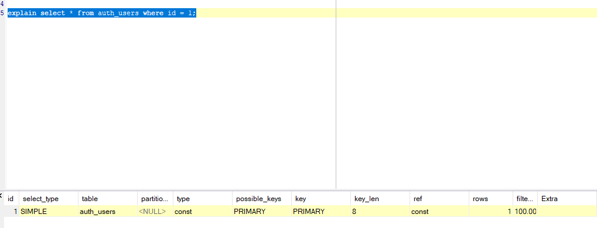

# mysql索引详解-你的数据库用对索引了嘛

mysql的索引一般分为主键索引，唯一索引，普通索引，联合索引，覆盖索引等。

索引这么多，到底该怎么用，用哪个索引适合，需不需要索引呢？

## innoDB的索引

innoDB里面一般采用b+树索引模型，当然还有其它比如哈希索引，全文索引，空间索引。但是常用的还是b+树索引。

B+树是一个N叉平衡树。为什么不用二叉平衡树呢，因为二叉平衡树高度太高了，n叉平衡树可以控制树的高度，大概在3-4的高度，而树的根节点一般存在内存中，这样只需要做2-3次磁盘操作就可以了。大量的减少了磁盘操作。

#### 主键索引

`主键索引`是一种聚簇索引，什么是`聚簇索引`呢，就是和数据放在一起的。b+树的叶子节点存放的是页，每个页的默认大小是16kb。主键索引树的叶子节点存放的是主键id和数据。一般我们都会用id做为主键。如果一个表不指定主键，Innodb会使用row id作为主键。

我们使用主键查询数据，来看一下执行计划。

```sql
explain select * from auth_users where id = 1;
```



可以看到里面key列显示的是primary，表示使用了主键索引。row列是1，表示扫描了一行。通过树搜索的方式快速定位了主键id的位置并且取出数据进行了返回。

为什么主键推荐使用`递增id`呢，这是因为对索引树的增删改查要更加快速。所以一般使用自增主键。也避免了插入引起的`页分裂`和删除引起的`页合并`。

如果现在表里有id=4,5,6的数据，你插入了一条id=3的数据。这时候存放id=4,5,6数据的数据页满了，就需要页分裂，变成两个数据页。

页合并就是相邻的两个数据页的数据都挺少的，可以合并到一起，那么就会页合并。

使用自增主键则只需要不断往后写入就可以了，不需要担心中间的插入。而且自增主键占用的空间同样相对较小。

#### 二级索引

`二级索引`也是`非聚簇索引`。包括`唯一索引`和`普通索引`。他们同样是b+树的方式存放，只是他们的叶子节点中存放的并不是真正的数据，而是主键id。那么通过这种索引怎么找到数据呢，其实是先找到对应的主键id，再去主键索引树中通过主键id找到对应的数据，也叫`回表`。

唯一索引和普通索引的区别在于查询的时候，唯一索引查询到条件对应的数据后不会接着查询了，而普通索引会接着查询，直到不满足条件为止。


#### 覆盖索引

`覆盖索引`是一种优化的手段。覆盖索引也是一种`联合索引`。

比如我们查询用户信息的时候，如果需要根据用户名查询用户名和密码。我们在用户名字段创建了一个索引。那么查询的时候就会走索引，但是查到的是id，还需要再去主键中找到数据，取出用户名和密码两个字段。

如果我们在用户名的索引树中不仅存了id，还存了我们需要的密码字段，不就不需要再去回表了吗？那我们就需要创建一个`用户名和密码的联合索引`。这样我们就不需要再回表了，这也就是覆盖索引。覆盖了我们要查询的字段。当然，你通过索引查询的时候，执行计划显示的行数还是1.这是因为回表这个操作是在innoDB里面做的，mysql是感觉不到的。

#### 索引下推

索引下推也是一种优化。比如我们要查询`用户名是张三`，`密码是123456`的用户。

```sql
select * from users where name = '张三' and pwd = '123456'
```

在mysql5.6以前，只能查询到张三这个数据以后回表找到数据在判断密码。

而mysqll5.6增加索引下推的优化之后，可以在索引遍历过程中，对name和pwd两个字段同时做判断。


## 唯一索引和普通索引

这两个索引到底该怎么选择，比如用户名字段，用户名当然是不能重复的了。那么它应该使用唯一索引还是普通索引呢？

一般用户注册的时候我们会判断用户名是否重复。所以用户名字段加唯一索引的价值并不大，我们的业务已经能保证它不重复了。

我们在上面说过，查询的时候，唯一索引查询到数据直接就返回了，显然要比普通索引快一些。

但是真的也就快了那么一点，因为InnoDB引擎在读取的时候，是读取一个数据页的数据。它会先把一个数据页读取到内存中，然后查询，那么在内存中多查一次其实没啥感觉。

在看一下更新的时候。

#### 数据在内存里面

如果数据在内存中，那么唯一索引会判断更新后是否会破坏唯一性，如果不破坏则更新。

普通索引则直接更新。

这里显示普通索引更好，不用判断。但是这个影响页很小，和上面一样，在内存中操作的。

#### 数据不在内存中

如果数据不在内存中，那么唯一索引就需要从磁盘读取数据，然后判断，更新。

普通索引则直接写入`change buffer`，然后就完成了，而change buffer则是在内存中，内存操作，少了磁盘操作。

整体来看，普通索引貌似比唯一索引更友好，唯一索引为了唯一性牺牲了插入和修改的性能。

#### change buffer

这个是一块内存中的空间，顾名思义，他就是为了修改而生的，如果你修改了数据，不需要直接更新磁盘，而是放入change buffer.change buffer满了，或者一定时间，或者当出现查询操作的时候，会merge数据，比如你更新了手机号，然后要查询这个用户的手机号。那么这时候内存中没有这个数据，从磁盘查询，磁盘查询到的是以前的手机号，因为数据没有更新到磁盘。这时候change buffer就会把更新数据合并到内存中的数据，使得查询到的是最新数据。

那么为什么唯一索引不适用change buffer，因为他需要判断唯一性。

但是向刚才举得例子，更新完立即查询，其实和唯一索引的更新没有啥区别了，反而因为change buffer还麻烦了。所以，change buffer更适合更新完不立即查询的场景。


